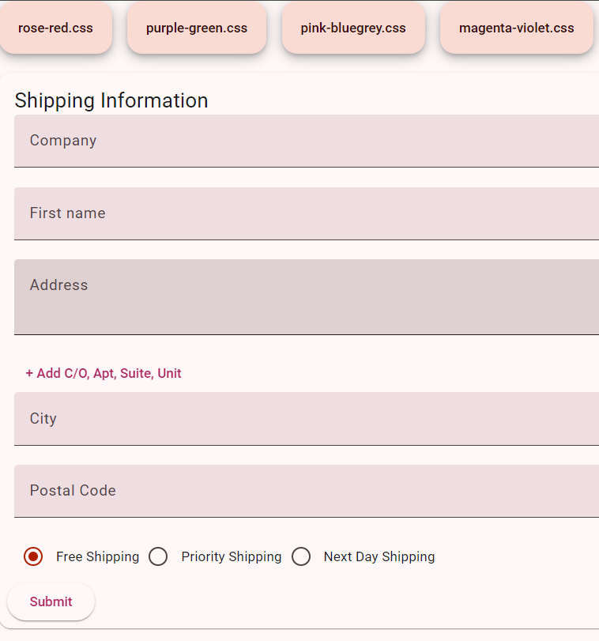
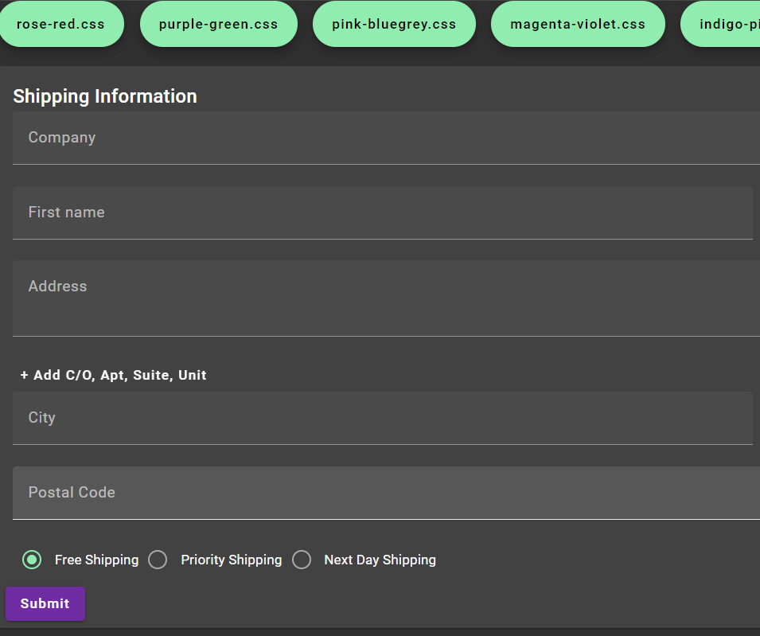

# ng18mat-dynamic-theme-change
A truly functional Angular Material 18 (Material 3) theme changer (currently probably the only existing one)

After many days of unsuccessful and desperate search for a solution based on the official documentation, searching the web, github, npm.js, searching for a solution, trying and testing various, always outdated solutions, it was possible to find a simple and functional solution based on the dynamic setting of prebuild themes. I also wanted to write on the Angular-Material github if they could link to a single (ONLY ONE) complete working solution that allows you to dynamically switch between light and dark themes, instead of partial code snippets, but I didn't believe they would.

---



---



---

# Key parts

## index.html
```
<link id="theme-link" rel="stylesheet" href="indigo-pink.css" />
```

```<body class="mat-app-background">
<app-root></app-root>
</body>```

## prebuild themes copied to folder public

## main component
loading saved theme:
```
  constructor() {
    const saved_theme = localStorage.getItem('selected-theme');
    if( saved_theme ){
      this.setTheme(saved_theme);
    }
    
  }
```

change theme:

``` 
    setTheme(theme: string) {
    const themeLink = this.renderer.selectRootElement('#theme-link', true);
    this.renderer.setAttribute(themeLink, 'href', theme);
    localStorage.setItem('selected-theme', theme);
  }
```